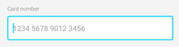
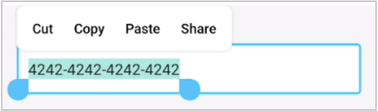

# creditcard-input-helper

[](https://circleci.com/gh/konifar/creditcard-input-helper/tree/master)
[](https://jitpack.io/#konifar/creditcard-input-helper)

Simple helper library to input credit card number, expiry month/year and security code on Android.

## Download

### Project build.gradle

```groovy
allprojects {
    repositories {
        ...
        maven { url "https://jitpack.io" }
    }
}
```

### App build.gradle

```groovy
dependencies {
    ...
    implementation 'io.konifar.cardinputhelper:LATEST_VERSION'
}
```

`LATEST_VERSION` is [](https://jitpack.io/#konifar/creditcard-input-helper).

## Features

### 1. CardNumberTextWatcher

Simple TextWatcher class to format and validate card number according to the card brand.



```kotlin
editText.addTextChangedListener(object : CardNumberTextWatcher(
    separatorType = CardNumberSeparatorType.SPACE, // SPACE or HYPHEN
    supportedCardBrand = arrayOf(
        Visa(), Amex(), Mastercard()
    ) // Set supported card brand in your app (default: all)
) {
    override fun onCardBrandChanged(cardBrand: CardBrand) {
        // Card brand is detected or changed
    }

    override fun onCardNumberErrorChanged(error: CardNumberError) {
        // Error occurs (If no error, CardNumberError.None)
    }

    override fun onCardNumberCompleted(cardBrand: CardBrand) {
        // Completed to input card number without any errors
    }
})
```

The supported brands are following.

Card Brand | Example number
:-- | :--
American Express | 3782 822463 10005
Diners Club | 3622 7206 2716 67
Discover | 6011 1111 1111 1117
JCB | 3566 0020 2036 0505
Mastercard | 5555 5555 5555 4444
Visa | 4242 4242 4242 4242

The error types are following.

Error type | Description
:-- | :--
Empty | Number is empty 
Not enough length | Number is less than format length (ex: less than 16 for Visa)
Unsupported brand | Number matches brand but it's not supported for the app
Invalid brand format | Number doesn't match brand prefix
Invalid card number | Number is invalid as Luhn algorithm

### 2. CardMonthYearTextWatcher

Simple TextWatcher class to format and validate month/year.


```kotlin
editText.addTextChangedListener(object : CardMonthYearTextWatcher() {
    override fun onCardMonthYearErrorChanged(error: CardMonthYearError) {
        // Error occurs (If no error, CardMonthYearError.None)
    }

    override fun onCardMonthYearCompleted() {
        // Completed to input card month/year without any errors
    }
})
```

The error types are following.

Error type | Description
:-- | :--
Empty | Text is empty 
Month required | Month is empty
Month invalid | Month is invalid like `13`, `00`
Year required | Year is empty
Year invalid | Year is invalid like `00`, `99` (more than 20 years later)
Expired | Month/Year is expired

### 3. NoCopyAndCutSelectionActionModeCallback

Simple ActionModeCallback class to remove copy and cut option menu.

Before | After
:--: | :--:
 | 

```kotlin
editText.customSelectionActionModeCallback = NoCopyAndCutSelectionActionModeCallback()
```

## Contributing
We are always welcome your contribution!
If you find a bug or want to add new feature, please raise issue.